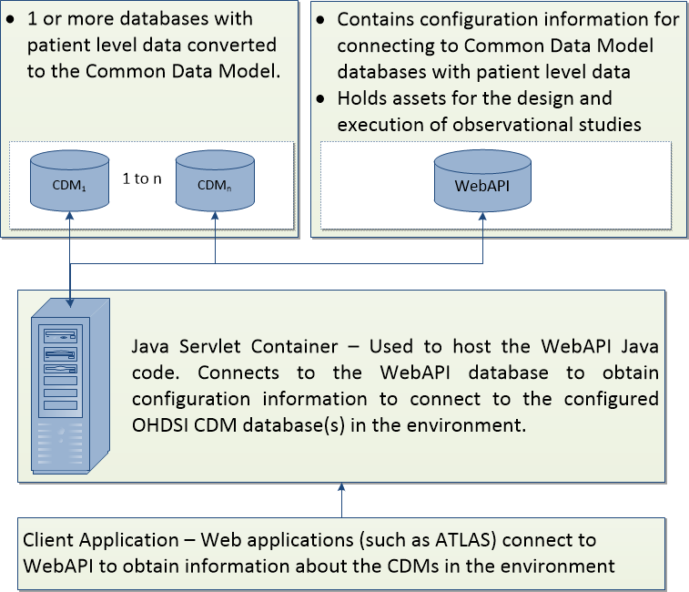

# OHDSI WebAPI Documentation

The OHDSI WebAPI is a Java-based application that is designed to provide a set of RESTful web services for interacting with one or more databases converted to the OHDSI Common Data Model (CDM) v5. WebAPI has its own dedicated database used to store the configuration that defines how to connect to the CDMs in the environment. The database is also used for the storage of assets (i.e. cohort definitions) used in the design and execution of observational studies. The principle web application that utilizes WebAPI is [Atlas](https://github.com/OHDSI/Atlas).

## Overview

The following diagram shows describes a logical architecture for the role  WebAPI plays in the OHDSI tools ecosystem:

Starting from the top of the diagram:

#### Database Configuration

- Your environment should contain 1 or more databases with patient level data converted to the CDM v5. If you do not have this available, you won't be able to fully utilize WebAPI.

- The WebAPI database is established to hold JDBC connection information regarding for each CDM you would like to use via WebAPI. It also stores the design assets that are developed through [Atlas](https://github.com/OHDSI/Atlas).

**Note:** WebAPI's database is designed only for PostgreSQL, SQL Server or Oracle only. The CDM database may exist on different database infrastructure (i.e. RedShift, SQL Server PDW, Google BigQuery, Impala, etc)

#### WebAPI Java Setup

- The WebAPI Java application is configured to connect to the WebAPI database to obtain information regarding the CDMs in the environment.

#### Client Connections to WebAPI

Client web applications (such as ATLAS) are configured to use WebAPI to design observational study assets.
