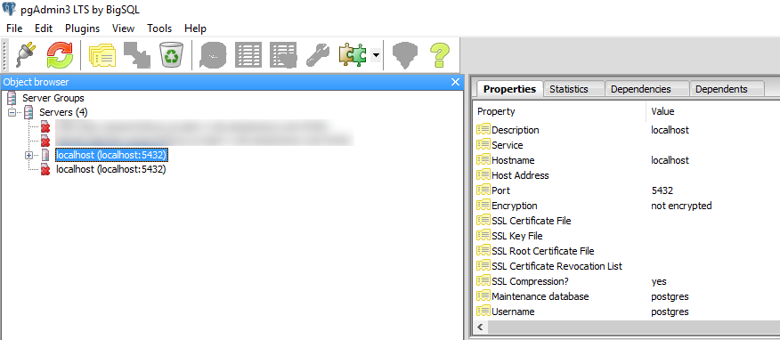
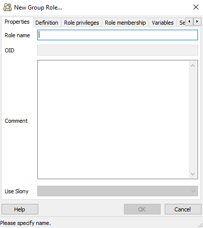
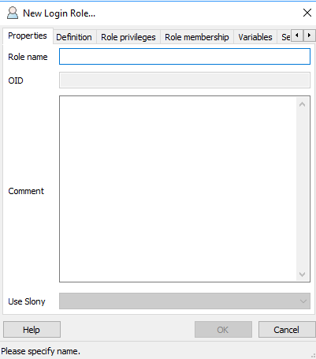
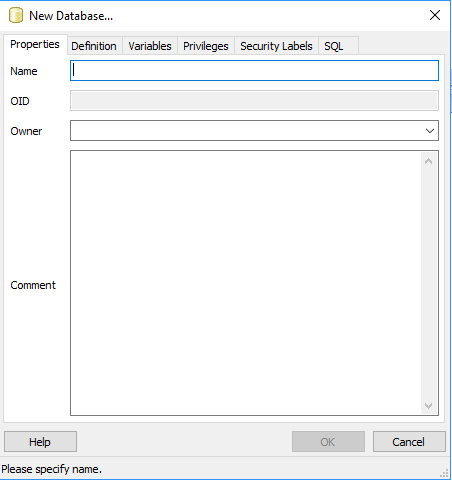
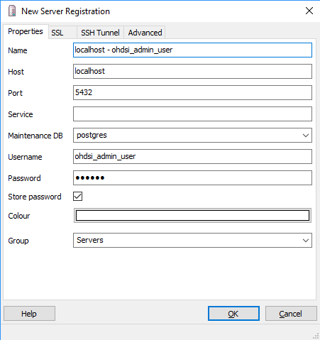
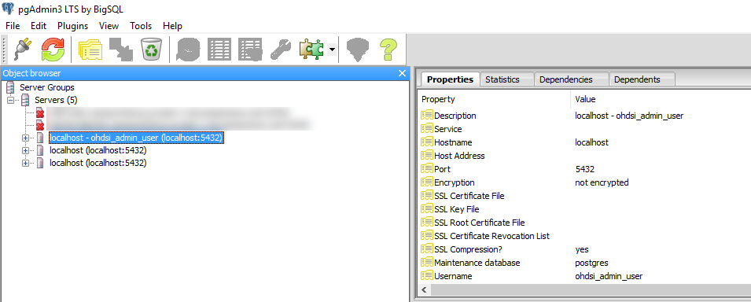
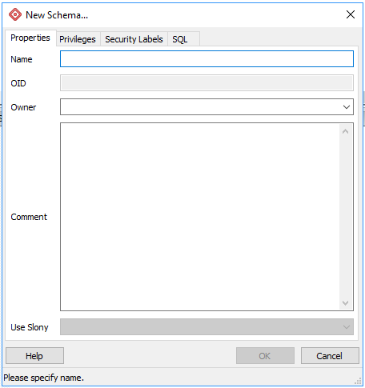
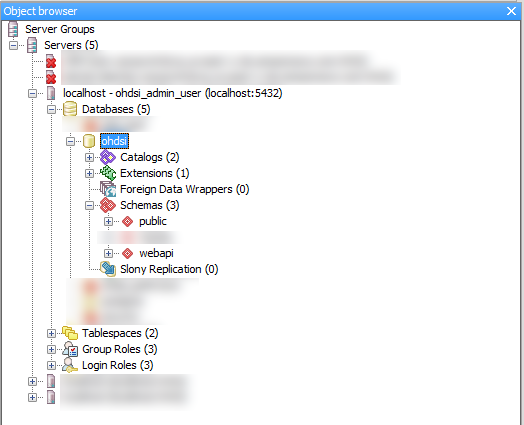

# PostgreSQL Setup Guide

## Database Engine Installation
You can install the PostgreSQL core distribution from the following URL: http://www.postgresql.org/download/. 

Follow your platform specific installation to install the binary and start the service. Remember the PostgreSQL user and password that is set during the installation process since this will be needed later to administer the server (creating new databases and adding new schemas).

## PostgreSQL database administration
For the database administration, we will be using the **pgAdmin3 tool** available from the PostgreSQL downloads URL above.  After launching, the main window will look similar to this:



### Creating The Database Users and Roles ###
If your environment already has application level administration and non-administrative access groups created, you can skip this section on creating the roles.

Before creating a database, roles and users should be created for administering the OHDSI WebAPI database and for non-administrative access (ie: application access) to the database.  The 2 groups created in this guide are `ohdsi_admin` and `ohdsi_app`.  The `ohdsi_admin` group will have ownership of the OHDSI database and have rights to create/alter/drop database objects, and the `ohdsi_app` group will have only the rights to access the database objects needed for the WebAPI service calls.

### Creating Database Group Roles ###
In pgAdmin, click on the server icon to expand the menu of options. Right click `Group Roles` and select `New Group Role`. This presents the following dialog:




Each tab will have values entered to configure the group.  Two groups are created: the admin group (to create the database and administer tables) and the app group to grant limited rights to the applications for accessing the database.

### Group: ohdsi_admin ###

#### Tab: Properties ####
- **Role Name**: ohdsi_admin
- **Comment**: Administration group for OHDSI applications

#### Tab: Definition ####

(Leave all values blank since we will not let this group log into the database)

#### Tab: Role Privileges ####
Check: Inherits rights from parent roles, can create databases, can initiate streaming replication and backups

#### Tab: Role membership ####

The ohdsi_admin role is not a member of any other parent group, so leave member empty. After these values are set, the generated SQL to create this role is produced:

```sql
CREATE ROLE ohdsi_admin
  CREATEDB REPLICATION
   VALID UNTIL 'infinity';
COMMENT ON ROLE ohdsi_admin
  IS 'Administration group for OHDSI applications';
```

### Group: ohdsi_app ###

#### Tab: Properties ####

Role Name: ohdsi_app
Comment: Application group for OHDSI applications

#### Tab: Definition ####

(Leave all values blank since we will not let this group log into the database)

#### Tab: Role Privileges ####

Check: Inherits rights from parent roles

#### Tab: Role membership ####

The ohdsi_app role is not a member of any other parent group, so leave member empty. After these values are set, the generated SQL to create this role is produced:

```sql
CREATE ROLE ohdsi_app
   VALID UNTIL 'infinity';
COMMENT ON ROLE ohdsi_app
  IS 'Application groupfor OHDSI applications';
```

### Creating Database Login Roles ###
In pgAdmin, right-click Login Roles and select ‘New Login Role’. This will present the dialog:



This dialog is similar to the group dialog, but in this case we will be setting the password for these logins and placing them into their corresponding roles (either _admin or _app).  This allows us to define permissions to the database at the group level, and not the individual user level.

### Login: ohdsi_admin_user ###

#### Tab: Properties ####

Role Name: ohdsi_admin_user

Comment: Admin user account for OHDSI applications

#### Tab: Definition ####

Password: admin1 **{note: do not use this for your production environment!}**

#### Tab: Role Privileges ####
Check: Inherits rights from parent roles

#### Tab: Role membership ####
Add the `ohdsi_admin` group to the list of members for this login. After these values are set, the generated SQL to create this role is produced:

```sql
CREATE ROLE ohdsi_admin_user LOGIN ENCRYPTED PASSWORD 'md58d34c863380040dd6e1795bd088ff4a9'
   VALID UNTIL 'infinity';
GRANT ohdsi_admin TO ohdsi_admin_user;
COMMENT ON ROLE ohdsi_admin_user
  IS 'Admin user account for OHDSI applications';
```

### Login: ohdsi_app_user ###

#### Tab: Properties ####

Role Name: ohdsi_app_user

Comment: Application user account for OHDSI applications

#### Tab: Definition ####

Password: app1 **{note: do not use this for your production environment!}**

#### Tab: Role Privileges ####

Check: Inherits rights from parent roles

#### Tab: Role membership ####
Add ohdsi_app group to the list of members for this login. After these values are set, the generated SQL to create this role is produced:

```sql
CREATE ROLE ohdsi_app_user LOGIN ENCRYPTED PASSWORD 'md55cc9d81d14edce93a4630b7c885c6410'
   VALID UNTIL 'infinity';
GRANT ohdsi_app TO ohdsi_app_user;
COMMENT ON ROLE ohdsi_app_user
  IS 'Application user account for OHDSI applications';
```

### Creating the OHDSI WebAPI database ###
**Note:** if you have an existing database you can skip this step and proceed to the schema preparation section below. In pgAdmin, right click Databases and select ‘New Database’.  The following dialog is displayed:



Then follow these steps for each tabbed option:

#### Tab: Properties ####

- **Name**: ohdsi
- **Owner**: ohdsi_admin
- **Comment**: OHDSI WebAPI database

#### Tab: Definition ####

Leave all attributes the default

#### Tab: Variables ####

Nothing to enter here

#### Tab: Privileges (in pgAdmin4: Security) ####

- Add role `ohdsi_admin` with `ALL` privileges
- Add role ohdsi_app with `Temp` and `Connect`. 
  
The following SQL is generated:

```sql
CREATE DATABASE "OHDSI"
  WITH ENCODING='UTF8'
       OWNER=ohdsi_admin
       CONNECTION LIMIT=-1;
COMMENT ON DATABASE "OHDSI"
  IS 'OHDSI database';
GRANT ALL ON DATABASE "OHDSI" TO GROUP ohdsi_admin;
GRANT CONNECT, TEMPORARY ON DATABASE "OHDSI" TO GROUP ohdsi_app;
```
---
### Prepare Database Schema for WebAPI ###
🙌 **Note: this step is extremely important.** 🙌 

*If you do not assign default permissions when connected as the `ohdsi_admin_user`, the `ohdsi_app_user` account will not be granted the correct access privileges when the WebAPI creates the tables in the database!_*

In pgAdmin, create a new connection to the PostgreSQL server, **using the ohdsi_admin_user account created above**. This account will be used to create the database to host the WebAPI schema and tables. The new connection should be configured as follows:



_Note: username and password was the admin user and password that was created above._ Once connected, the pgAdmin3 as `ohdsi_admin_user`, object browser should look as follows:



Expand the server icon, under Databases, open the `ohdsi` database, and right click on `Schemas` to create a new schema:



#### Tab: Properties ####

- **Name**: webapi
- **Owner**: ohdsi_admin
- **Comment**: Schema containing tables to support WebAPI functionality

#### Tab: Privileges (in pgAdmin4: Security) ####

- Add `PUBLIC` as `USAGE`
- Add `ohdsi_admin` as `ALL`
- Add `ohdsi_app` as `USAGE`. 
  
The following SQL is generated:

```sql
CREATE SCHEMA webapi
       AUTHORIZATION ohdsi_admin;
COMMENT ON SCHEMA webapi
  IS 'Schema containing tables to support WebAPI functionality';
GRANT USAGE ON SCHEMA webapi TO PUBLIC;
GRANT ALL ON SCHEMA webapi TO GROUP ohdsi_admin;
GRANT USAGE ON SCHEMA webapi TO GROUP ohdsi_app;
```

Once the schema is created, right click on the new schema `webapi` and select `Properties`

#### Tab: Default Privileges ####

##### Sub-Tab:  Tables #####
- Add group `ohdsi_app` with `INSERT, SELECT, UPDATE, DELETE, REFERENCES and TRIGGER`.

##### Sub-Tab: Sequences #####
- Add group `ohdsi_app` with `SELECT and USAGE`

##### Sub-Tab: Functions #####
- Add group `ohdsi_app` with `EXECUTE`

##### Sub-Tab: Types ######
- Add group `ohdsi_app` with `USAGE`

The following SQL is generated:

```sql
ALTER DEFAULT PRIVILEGES IN SCHEMA webapi
    GRANT INSERT, SELECT, UPDATE, DELETE, REFERENCES, TRIGGER ON TABLES
    TO ohdsi_app;

ALTER DEFAULT PRIVILEGES IN SCHEMA webapi
    GRANT SELECT, USAGE ON SEQUENCES
    TO ohdsi_app;

ALTER DEFAULT PRIVILEGES IN SCHEMA webapi
    GRANT EXECUTE ON FUNCTIONS
    TO ohdsi_app;

ALTER DEFAULT PRIVILEGES IN SCHEMA webapi
    GRANT USAGE ON TYPES
    TO ohdsi_app;
```
👉 **Note**: If you do not assign default privileges when connected as the `ohdsi_admin_user`, the `ohdsi_app_user` account will **not** be granted the correct access privileges when the WebAPI creates the tables in the database!

After creating the schemas and assigning the default privileges, the object browser should look as follows:



Keep handy the passwords for the accounts you set up in this process (`ohdsi_admin_user` and `ohdsi_app_user`) as they will be used in the configuration and setup of WebAPI.