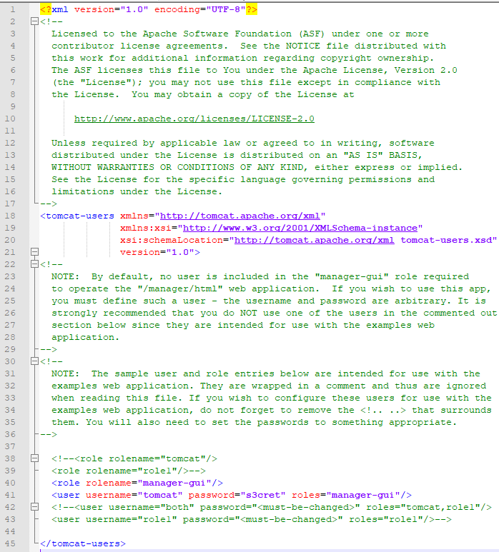
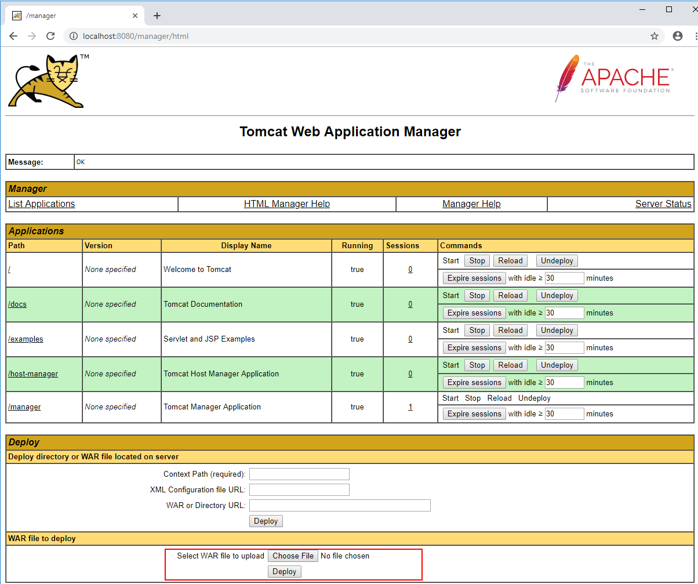

# WebAPI Installation Guide

# Overview
This page describes the database setup, maven build configuration and deployment of OHDSI/WebAPI to a Apache Tomcat environment. This application is Java-based, packaged as a WAR, and should be able to be deployed into any Java servlet container.

This guide is intended to provide a basic setup guide on a Windows operating system. **This guide is not intended for setting up production systems**. There are other efforts in the OHDSI Community that are focused on providing more enterprise-ready setups for the OHDSI Tools. These include the Broadsea project: https://github.com/OHDSI/Broadsea and OHDSI on AWS: https://github.com/OHDSI/OHDSIonAWS. 

# Software

You will need the following software as part of this setup guide:

- **Text Editor**: Notepad++ or your favorite editor for editing configuration files
  
- **[Java 8 Java Development Kit (JDK)](https://www.oracle.com/technetwork/java/javase/downloads/jdk8-downloads-2133151.html)**: Install this to the default location on your computer and note the location. Ensure that the `JAVA_HOME` environmental variable is set for Windows by using the following command from a command prompt:

```
set JAVA_HOME=C:/Program Files/Java/jdk1.8.0_201
```
⚠️ _Make sure you point to a JDK, not a Java Runtime Environment (JRE)._

👉**R Users**: _The `JAVA_HOME` environmental variable can cause problems when attempting to use OHDSI R libraries. You may want to remove this after you are done building WebAPI_


- **[Git](https://git-scm.com/downloads)**: Install this on your computer in order to clone the project repository. 
  
- **[Apache Maven](https://maven.apache.org/download.cgi)** - Install maven to build the Java project for installation into your Java servlet container. Note the location of the installation (for this guide we'll use `C:\maven`.) Refer to the [Maven on Windows](https://maven.apache.org/guides/getting-started/windows-prerequisites.html) guide to set your `MAVEN_HOME` environment variable to add the location where you installed Maven (`C:\maven`) and add `C:\maven\bin` to the PATH environment variable.

- **[Apache Tomcat 8](https://tomcat.apache.org/download-80.cgi)**: Its a good idea to make sure the version of Tomcat matches your Java version. Download the version appropriate for your operating system. Extract it to your computer and note the location (`C:\tomcat`).
  
- **Database Query Tool**: Use your favorite database query tool (such as [SQL Workbench/J](https://www.sql-workbench.eu/)). This will be used to verify the database setup.
  
- **Database platform for WebAPI Database**: WebAPI requires a database on any one of these platforms:
    - MS SQL 2012
    - PostrgeSQL 10
    - Oracle 11gXE

⭐️ **Important:** This database platform is for hosting the **WebAPI Configuration Database** not your patient-level data converted to the Common Data Model.

🙌 **_Please Note_**: We'd strongly encourage you to use **PostgreSQL** as we do **plan to stop utilizing** SQL Server and Oracle in **WebAPI 3.0** and forward.

# Database Preparation

If you already have a database server you plan to use, please refer to the install guides as they contain information on how to set up the database required by WebAPI.

## Install And Configure the Database Platform
Follow the setup guide for your database platform:
- [PostgreSQL 10](https://github.com/OHDSI/WebAPI/wiki/PostgreSQL-Installation-Guide)
- [SQL Server 2012](https://github.com/OHDSI/WebAPI/wiki/SQL-Server-Setup-Guide) 
- [Oracle 11g XE](https://github.com/OHDSI/WebAPI/wiki/Oracle-DB-Setup-Guide)

✅ Note the **database name, user names and passwords** created as part of this process as they are required for the WebAPI setup.

## Test the database connection

It is critical to ensure that you have proper database connectivity before attempting to install WebAPI. Here are some high-level steps to follow **on the machine that will run WebAPI**:

- Use the database query tool to connect to the database server. 
- Log into the database using the application user name and password - if you followed the guides above, this will be the `ohdsi` database and the `ohdsi_app_user`. 

Once you have ensure that the connection works, your ready to configure, build and run WebAPI.


# Installing WebAPI

## Clone the WebAPI project

Create a folder (for example `C:\Git\OHDSI`) and navigate to it. From within your project directory, clone the project using `git`: 

```
C:\Git\OHDSI> git clone https://github.com/OHDSI/WebAPI.git
```

### Create settings.xml file
In the root of the WebAPI project, there is a file named `sample_settings.xml` which 3 `<profile>` blocks for the 3 WebAPI database platforms. Open the `sample_settings.xml`, copy out the corresponding `<profile>` block for the database platform you will use for WebAPI and place it into a new file named `settings.xml` in the root of your WebAPI foder. Your `settings.xml` file should look like this:

```
<settings>
<profile>
  👉<id>webapi-postgresql</id>
  <properties>
      ...settings omitted for brevity...
  </properties>
</profile>
</settings>
```

✅ Note the ID of the profile (i.e. `webapi-postgresql`) since this is needed for the WebAPI build step.

## Configure & Build WebAPI

### Configure the Maven profile

Next we need to configure the maven profile to match the environment setup. Here are some important settings to review:

- `datasource.url`: This is the JDBC URL to your database server. If your database is not on the same machine as WebAPI, you'll want to make sure this is set. If you tested this in the previous section, make note of the settings that allowed for proper connection from your database query tool.
- `datasource.username` and `datasource.password`: These are the application username and password respectively. If you followed the database setup guides, this will be the `ohdsi_app_user` account. 
- `flyway.datasource.username` and `flyway.datasource.password`: These are the application administrator username and password respectively. This is the `ohdsi_admin_user` from the database setup guide.
- `security.origin`: This is the name of the server where WebAPI is running. Note that `localhost` is not the server name but rather a standard network term that refers to the current machine. So, leaving this as `localhost` will allow WebAPI to work when accessing it from within the same computer however it will not be reachable from outside of the machine. You can also change this to `*` if you are comfortable with any machine connecting to WebAPI.
- `server.port`: This is the default port where WebAPI will be accessed. The `security.origin` and `server.port` settings make up the basis for your root URL to WebAPI. In this case, it will be ``http://<security.origin>:<server.port>`` (i.e. http://localhost:8080).

By default, WebAPI does **not** require authentication and authorization. The [Basic Security Configuration Guide](Basic-Security-Configuration.md) covers this in more detail if you'd like to use security.

### Oracle Specific Configuration

**NOTE: This is only necessary if you host your WebAPI database on Oracle**
You will need to download the Oracle JDBC driver, and install it into your local maven repository.  Once you download the jar, you will need to execute the following maven command to install it into the local repository.  The simplest way is to navigate via the CLI to the directory the JAR was downloaded to, and execute the following command:
```
mvn install:install-file -Dfile=ojdbc.jar -DgroupId=ojdbc -DartifactId=ojdbc -Dversion=6.0.0 -Dpackaging=jar
```
(The above is all a single line command.)


### Building the WebAPI .war file using Maven

From the root of the WebAPI Project folder (`C:\Git\OHDSI\WebAPI`) run the following maven command to create the .war file which will be used to deploy and run WebAPI:

```
C:\Git\OHDSI\WebAPI> mvn clean package -s settings.xml -DskipTests=true -P {profile id} 
```
👉 **Note: {profile id}** is set to the value of the profile ID from the example configuration as described in the *Clone the WebAPI project* section.  The valid values for this are `webapi-postgresql`, `webapi-mssql` or `webapi-oracle`.  

This will create the file `WebAPI.war` in the `target` WebAPI subfolder (`C:\Git\OHDSI\WebAPI\target\WebAPI.war`). Note this location in order to deploy this .war to the Tomcat container which will then provide you a container to run the Java application and provide you with the service to allow communications via HTTP.

## Deploy WebAPI to Tomcat

For the purposes of this guide, we'll start Tomcat from a command line. In an environment where you'd like to have WebAPI running continuously, you'll want to consider setting up a dedicated service so that the Tomcat service can start/stop when the computer starts/stops. Furthermore, since this is a simple setup guide, it is important to note that you do not want to set up a production instance of Tomcat in this way. This is simply a quick way to get Tomcat running for use with WebAPI.

### Tomcat Configuration

Before we can deploy WebAPI, we need to configure Tomcat to allow us to log into the manager interface. To do this, navigate to the `conf` folder (`C:\tomcat\conf`) and edit the file `tomcat-users.xml`. Add the following XML in the `<tomcat-users>` block:

```
  <role rolename="manager-gui"/>
  <user username="tomcat" password="s3cret" roles="manager-gui"/>
```

Your file should look similar to this one:



Next, we will need to configure the Tomcat manager application to allow for uploads larger than 50MB to ensure we can deploy WebAPI. Edit the file: `C:\tomcat\webapps\manager\WEB-INF\web.xml` and find the section that reads:

```
    <multipart-config>
      <!-- 50MB max -->
      <max-file-size>52428800</max-file-size>
      <max-request-size>52428800</max-request-size>
      <file-size-threshold>0</file-size-threshold>
    </multipart-config>
```
Update this to read:

```
    <multipart-config>
      <!-- 100MB max -->
      <max-file-size>104857600</max-file-size>
      <max-request-size>104857600</max-request-size>
      <file-size-threshold>0</file-size-threshold>
    </multipart-config>
```

### Tomcat Startup

To start Tomcat, open a command prompt and navigate to the `bin` folder where you installed Tomcat (`C:\tomcat\bin`) and run:

```
C:\tomcat\bin> catalina.bat run > ..\logs\webapi.log 2>&1
```

In the command above, `catalina.bat run` will start the Tomcat service and the `> ..\logs\webapi.log 2>&1` portion of the command will write the output to Tomcat's `logs\webapi.log`.

### Deploy WebAPI using Tomcat Application Manager

Open a web browser, navigate to http://localhost:8080/manager and you will be prompted for credentials. Enter the user name of `tomcat` and password of `s3cret` as configured in the step above. You will then see the manager screen:



At the bottom of the manager screen, you will see an area labled `WAR file to deploy`. Click on the `Choose File` button and navigate to the location of the WebAPI.war file ((`C:\Git\OHDSI\WebAPI\target\WebAPI.war`). Click the `Deploy` button to deploy and start up WebAPI.

### Verify WebAPI Deployment

Give the .WAR time to upload and then open `c:\tomcat\logs\webapi.log` using a text editor to monitor the progress. If all has worked, you will see a message in the logs such as:

`org.ohdsi.webapi.WebApi -  - Started WebApi in xx.xxx seconds (JVM running for yy.yy)`

Using the database query tool, you can also confirm that a large number of tables are created in the `webapi` schema of your `ohdsi` database.

Reading the Tomcat logs, the following output should appear indicating that the tables have been created (in this example, we see an Oracle output):
```
2016-02-24 11:01:08.148 INFO org.ohdsi.webapi.WebApi.main() org.flywaydb.core.internal.dbsupport.DbSupportFactory -  - Database: jdbc:oracle:thin:@//127.0.0.1:1521/xe (Oracle 11.2)
2016-02-24 11:01:08.358 INFO org.ohdsi.webapi.WebApi.main() org.flywaydb.core.internal.metadatatable.MetaDataTableImpl -  - Creating Metadata table: "OHDSI"."schema_version"
2016-02-24 11:01:08.468 INFO org.ohdsi.webapi.WebApi.main() org.flywaydb.core.internal.command.DbMigrate -  - Current version of schema "OHDSI": << Empty Schema >>
2016-02-24 11:01:08.468 WARN org.ohdsi.webapi.WebApi.main() org.flywaydb.core.internal.command.DbMigrate -  - outOfOrder mode is active. Migration of schema "OHDSI" may not be reproducible.
2016-02-24 11:01:08.468 INFO org.ohdsi.webapi.WebApi.main() org.flywaydb.core.internal.command.DbMigrate -  - Migrating schema "OHDSI" to version 1.0.0.1
2016-02-24 11:01:08.608 INFO org.ohdsi.webapi.WebApi.main() org.flywaydb.core.internal.command.DbMigrate -  - Migrating schema "OHDSI" to version 1.0.0.2
2016-02-24 11:01:08.628 INFO org.ohdsi.webapi.WebApi.main() org.flywaydb.core.internal.command.DbMigrate -  - Migrating schema "OHDSI" to version 1.0.0.3
2016-02-24 11:01:08.668 INFO org.ohdsi.webapi.WebApi.main() org.flywaydb.core.internal.command.DbMigrate -  - Migrating schema "OHDSI" to version 1.0.0.3.1
2016-02-24 11:01:08.778 INFO org.ohdsi.webapi.WebApi.main() org.flywaydb.core.internal.command.DbMigrate -  - Migrating schema "OHDSI" to version 1.0.0.3.2
2016-02-24 11:01:08.798 INFO org.ohdsi.webapi.WebApi.main() org.flywaydb.core.internal.command.DbMigrate -  - Migrating schema "OHDSI" to version 1.0.0.4
2016-02-24 11:01:08.987 INFO org.ohdsi.webapi.WebApi.main() org.flywaydb.core.internal.command.DbMigrate -  - Migrating schema "OHDSI" to version 1.0.0.4.1
2016-02-24 11:01:09.007 INFO org.ohdsi.webapi.WebApi.main() org.flywaydb.core.internal.command.DbMigrate -  - Migrating schema "OHDSI" to version 1.0.0.4.2
2016-02-24 11:01:09.027 INFO org.ohdsi.webapi.WebApi.main() org.flywaydb.core.internal.command.DbMigrate -  - Migrating schema "OHDSI" to version 1.0.0.4.3
2016-02-24 11:01:09.068 INFO org.ohdsi.webapi.WebApi.main() org.flywaydb.core.internal.command.DbMigrate -  - Migrating schema "OHDSI" to version 1.0.0.5
2016-02-24 11:01:09.148 INFO org.ohdsi.webapi.WebApi.main() org.flywaydb.core.internal.command.DbMigrate -  - Migrating schema "OHDSI" to version 1.0.0.5.1
2016-02-24 11:01:09.168 INFO org.ohdsi.webapi.WebApi.main() org.flywaydb.core.internal.command.DbMigrate -  - Migrating schema "OHDSI" to version 1.0.0.6.1
2016-02-24 11:01:09.348 INFO org.ohdsi.webapi.WebApi.main() org.flywaydb.core.internal.command.DbMigrate -  - Migrating schema "OHDSI" to version 1.0.0.6.2
2016-02-24 11:01:09.750 INFO org.ohdsi.webapi.WebApi.main() org.flywaydb.core.internal.command.DbMigrate -  - Migrating schema "OHDSI" to version 1.0.0.6.3
2016-02-24 11:01:09.780 INFO org.ohdsi.webapi.WebApi.main() org.flywaydb.core.internal.command.DbMigrate -  - Migrating schema "OHDSI" to version 1.0.0.7.0
2016-02-24 11:01:09.840 INFO org.ohdsi.webapi.WebApi.main() org.flywaydb.core.internal.command.DbMigrate -  - Migrating schema "OHDSI" to version 1.0.0.7.1
2016-02-24 11:01:09.920 INFO org.ohdsi.webapi.WebApi.main() org.flywaydb.core.internal.command.DbMigrate -  - Migrating schema "OHDSI" to version 1.0.0.7.2
2016-02-24 11:01:10.020 INFO org.ohdsi.webapi.WebApi.main() org.flywaydb.core.internal.command.DbMigrate -  - Migrating schema "OHDSI" to version 1.0.0.8
2016-02-24 11:01:10.060 INFO org.ohdsi.webapi.WebApi.main() org.flywaydb.core.internal.command.DbMigrate -  - Migrating schema "OHDSI" to version 1.0.1.0
2016-02-24 11:01:10.090 INFO org.ohdsi.webapi.WebApi.main() org.flywaydb.core.internal.command.DbMigrate -  - Migrating schema "OHDSI" to version 1.0.1.1
2016-02-24 11:01:10.130 INFO org.ohdsi.webapi.WebApi.main() org.flywaydb.core.internal.command.DbMigrate -  - Migrating schema "OHDSI" to version 1.0.1.1.1
2016-02-24 11:01:14.482 INFO org.ohdsi.webapi.WebApi.main() org.flywaydb.core.internal.command.DbMigrate -  - Successfully applied 21 migrations to schema "OHDSI" (execution time 00:06.124s).
```

Other platforms should see similar output, except for the JDBC url in the connection.  Use your DB platform's query tool to verify tables now exist in the schema.

If all worked, you can verify that WebAPI is working by navigating to http://localhost:8080/WebAPI/info and you should see the following output:

```
{"version":"2.7.0"}
```

This output indicates that WebAPI version 2.7.0 is now running. Next, you will need to establish a connection between WebAPI and your CDM v5 database(s) which is covered in the [CDM Configuration](CDM-Configuration) section.


# Troubleshooting

## Errors during WebAPI startup

If errors are encountered in the logs of WebAPI, the most likely reason is JDBC url was not set properly (note: database names are case sensitive!), or the admin user was not granted privileges to create the necessary tables in the webapi schema.

## Errors when calling sources URL

The most likely error you will receive when accessing http://localhost:8080/WebAPI/source/sources
is the ohdsi_app_user does not have permission on relation ‘source’.  This means the default privileges were not assigned when logged into the database as ohdsi_admin_user.  These table permissions will have to be granted manually.

If no error is appearing in the logs at all, please confirm the Tomcat servlet engine is listening on port 8080. If it is on a different port, you will need to adjust the URLs above to the correct port.
